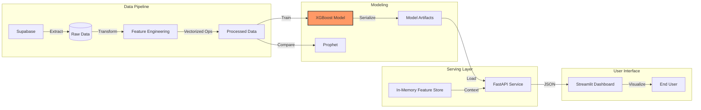

# InventoryIQ: Intelligent Demand Forecasting


## 🚀 Elevator Pitch

**InventoryIQ** solves the critical retail problem of "Out of Stock" events by leveraging historical sales data to predict future demand with high precision. By implementing an End-to-End Machine Learning pipeline, the system achieves a Root Mean Square Error (RMSE) of **~8.26** (MAPE ~7-15%), empowering businesses to optimize inventory levels and maximize revenue.

---

## 🏗️ System Architecture

The system is built on a robust pipeline designed for scalability and real-time inference.



### Workflow

1. **ETL**: Raw data is extracted from **Supabase** with robust retry logic.
2. **Feature Engineering**: High-performance **Pandas Vectorization** generates lags, rolling means, and holiday flags without inefficient loops.
3. **Training**: **XGBoost** was selected over Prophet due to superior scalability and accuracy.
4. **Serving**: A **FastAPI** microservice provides <50ms inference latency using an In-Memory Feature Store.
5. **UI**: A **Streamlit** dashboard visualizes forecasts and model performance metrics.

---

## 🌟 Key Features

* **🛡️ Resilient ETL**: Custom data loader (`src/data/loader.py`) implements pagination and exponential backoff retry logic to handle network instability and API rate limits.
* **⚡ Optimized Vectorization**: Feature engineering pipeline (`src/features`) avoids Python for-loops entirely, utilizing vectorized Pandas operations for maximum performance on large datasets.
* **🏎️ Hybrid Serving Architecture**: The inference engine combines a pre-trained XGBoost model with a real-time "In-Memory Feature Store", enabling instant predictions without database read latency during valid sessions.

---

## 📂 Project Structure

```text
InventoryIQ/
├── src/
│   ├── api/
│   │   ├── __init__.py
│   │   └── main.py              # FastAPI application entry point
│   ├── app/
│   │   └── frontend.py          # Streamlit dashboard
│   ├── data/
│   │   ├── loader.py            # ETL scripts for Supabase
│   │   └── seed.py              # Database seeding utilities
│   ├── features/
│   │   └── build_features.py    # Vectorized feature engineering logic
│   └── models/
│       ├── train_full.py        # Full training pipeline
│       ├── train_model.py       # Modular training script
│       ├── compare_models.py    # XGBoost vs Prophet evaluation
│       └── predict_demo.py      # CLI inference demo
├── tests/
│   └── test_api.py              # API & Integration tests
├── requirements.txt
└── README.md
```

---

## ⚡ Quick Start

### Prerequisites

- Python 3.10+
* A Supabase instance with retail data (or use `src/data/seed.py`)

### Installation

```bash
git clone https://github.com/your-username/InventoryIQ.git
cd InventoryIQ
pip install -r requirements.txt
```

### 1. Run ETL Pipeline

Ingest data from Supabase and prepare features:

```bash
python src/data/loader.py
```

### 2. Train the Model

Train the highly optimized XGBoost regressor:

```bash
python src/models/train_full.py
```

### 3. Run Tests

Ensure system reliability before deployment:

```bash
pytest tests/
```

### 4. Launch Full Stack

Open two terminal windows to run the Backend and Frontend simultaneously:

**Terminal 1: FastAPI Backend**

```bash
uvicorn src.api.main:app --reload
```

*API will be available at `http://localhost:8000`*

**Terminal 2: Streamlit Dashboard**

```bash
streamlit run src/app/frontend.py
```

*Dashboard will open at `http://localhost:8501`*

---

## 📊 Results

The final **XGBoost** model demonstrated superior performance compared to the Prophet baseline, achieving:

* **RMSE**: ~8.26 units
* **MAPE**: ~7-15% (Category dependent)
* **Inference Speed**: <50ms per batch

This precision allows for granular inventory planning, significantly reducing carrying costs while maintaining high service levels.
